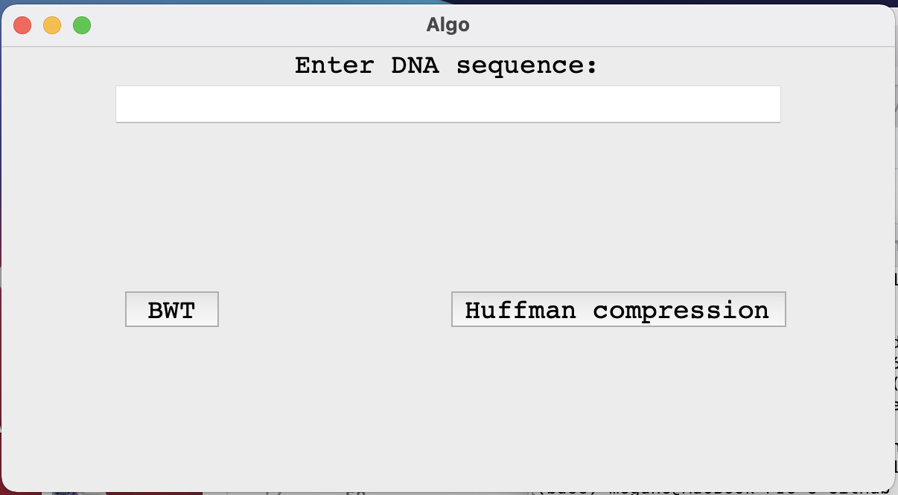
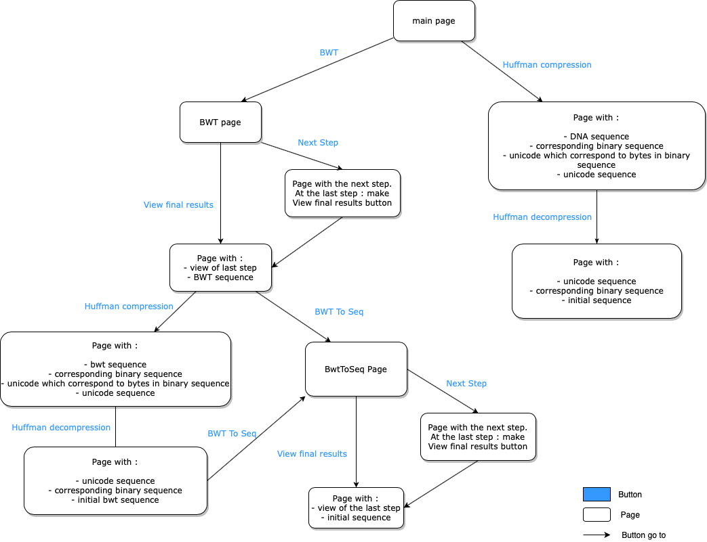
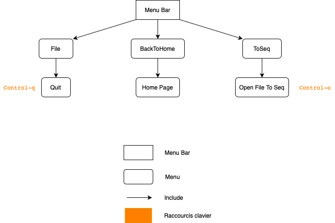

# Algo's project

This project consists of programming:

* Burrows-Weeler transformation
* Huffman compression
* Graphical user interface

It allows make Burrows-Weeler transformation and Huffman compression of a **DNA sequence**.

## Requirements
* [Python 3](https://www.python.org/)
* [Tkinter](https://docs.python.org/3/library/tkinter.html)

## How use this application  ?

First, clone the Algo_project repository on your computer :

```sh
git clone https://github.com/MeganeBoujeant/Algo_project.git
```

After, go on the appropriate folder :

```sh
cd Algo_project/scripts
```

Then, you can start the application with python 3 :

```python
python3 main_controller.py
```

You arrive on the main page of the application :



**Now you can start using the application!**

If you want a user guide, look at the Guide tab below.
You can also see the documentation of my scripts in the concern tab.

## Guide

### Here is the diagram that shows the operation that you can make from the main page :



### Here is the diagram that shows the menu bar of the application :



#### If you click on Quit menu (or if you use the shortcut Control-q), the application will close.

#### If you click on Home Page menu, your return on the main page of the application.

#### If you click on Open File To Seq menu (or if you use the shortcut Control-o), an file search interface opens.
3 choices then offers you:
* If you select **bwt.txt** file : a new page with your BWT sequence opens. From this page, you can make BWT reconstruction to return at the initial DNA sequence, or you can make Huffman compression.
* If you select **huffile.txt** file : the program make a Huffman decompression. If needed, make BWT reconstruction. And finaly display a new page with your initial DNA sequence.
* If you select **dechufile.txt** file : the program open a recontruction BWT page to return initial DNA sequence.


## Documentation of my scripts
You can find a web documentation on docs/build/html.
To view this, open index.html on your browser.

## About

### :scroll: License 
**MIT Licensed** © [Boujeant Megane](https://github.com/MeganeBoujeant), 2021.

[](https://www.python.org/)
[](https://forthebadge.com)
[](https://GitHub.com/)
